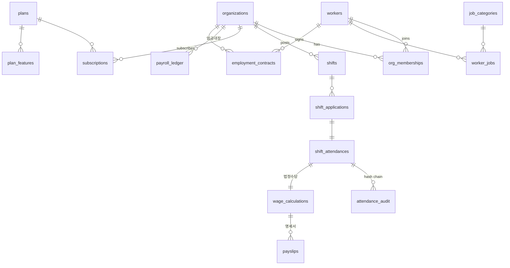

# Itdat(잇닿) 확장 설계 — 긱 매칭 + 선택형 노무관리 SaaS

> 작성: 2026-06-22 · 목적: atman(긱 매칭 MVP)을 **확장성 있는 구조 + 선택형 유료 노무관리**로 확장
> 배경: 2026 포괄임금 오남용 방지 지침(4.8) · 근로시간 전자기록 의무화(5월, 5인+, 3년 보관, 위반 형사처벌)

---

## 0. 핵심 전략

```
긱 매칭(무료/기본) 으로 워커·근로시간·사업장 데이터를 모으고,
그 데이터로 "법규 준수 자동화(노무관리)"를 사업장에 유료 SaaS로 판다.
```

- atman의 **QR 체크인/체크아웃 = 법이 의무화한 전자 근로시간 기록** → 이미 가진 최대 해자.
- 노무관리는 **선택형 유료 모듈**. 매칭만 쓰는 사업장은 무료, 노무까지 쓰면 과금.
- 케어닥(700억 받고도 적자)이 못 한 **다각화를 처음부터 구조에 내장.**

---

## 1. 비즈니스 모델 — 모듈형 티어 (이번 확장의 핵심)

### 1.1 플랜 구조 — 통합 유도형 (anchor = 통합툴)

> 전략: **노무/컴플라이언스가 지금 시장의 급한 통증**(기사 +138%)이므로, 통합툴을 헤드라인·앵커로
> 두고 매칭만은 저가 다운셀로 둔다. 통합가를 "따로 사는 것보다 이득"으로 앵커링해 자연 유도.

| 플랜 | 매칭 | 노무관리 | 포지션 | 과금 |
|---|---|---|---|---|
| **매칭 Lite** | ✅ | ❌ | 인력만 급한 곳 (다운셀) | 매칭 수수료(시프트당 12%)만 |
| **노무** | ❌ | ✅ | 외식·소상공인 컴플라이언스(매칭 불필요) | 사업장 월 구독 |
| **🌟 통합 (추천/앵커)** | ✅ | ✅ | **헤드라인 상품** — 매칭+노무 한 번에 | 통합 월 구독(묶음 할인) + 매칭 수수료 |
| Enterprise | ✅ | ✅+ | 다점포·법인 | 협의(다점포 통합·API·4대보험·전담) |

- 엔지니어링: 4개 플랜 모두 **동일 plan/entitlement 구조의 데이터 설정**일 뿐 — 코드 재작성 없음.
- 노무 기능 묶음 = `hr.*` feature_key 세트. 매칭 = `match.*`. 플랜은 이 키들의 조합.

### 1.2 과금 단위 (제안)
- **기본**: 사업장(organization)당 월 정액 + 활성 워커 수 구간제 (예: ~5인 / ~20인 / 무제한).
- 노무 모듈은 **org 단위 on/off** → 한 워커가 여러 사업장에 속해도 과금은 사업장 기준.
- 정부 "노동시간 전산시스템 구축 지원(200개소)" → **도입 보조금이 영업 레버리지**.

### 1.3 기능 게이팅 (엔지니어링 원칙)
- 모든 노무 기능은 **entitlement 체크**를 통과해야 실행 (DB·API·UI 3중).
- 플랜 → 기능 매핑은 **데이터(plan_features)** 로 관리 → 코드 배포 없이 패키징 변경 가능.
- 결제 실패/해지 시 **데이터는 보존(읽기 전용)**, 신규 발급만 차단 (법정 3년 보관 의무 때문).

---

## 2. 데이터 모델

### 2.1 코어 일반화 (확장성 토대) — "헬스케어 전용 → 범용"

현재 `facilities`(요양병원 특화) / `workers.role(rn/na)` 를 일반화:

```sql
-- 사업장 (기존 facilities 대체/확장)
organizations (
  id, name, biz_reg_no, industry_code,        -- 업종(외식·돌봄·의료…)
  employee_count, is_5plus BOOLEAN,            -- 5인 이상 = 법규 적용 분기
  location geography, address_text,
  plan_id, ...                                 -- 현재 구독 플랜
)

-- 직군 (rn/na 하드코딩 제거 → 무한 확장)
job_categories ( id, code, name_ko, sector )   -- 간호/조무/조리/서빙/돌봄/...
worker_jobs ( worker_id, job_category_id )      -- 다대다

-- 소속/멤버십 (워커 ↔ 사업장, 멀티테넌트 키)
org_memberships ( org_id, worker_id, role, status, joined_at )
```

> 마이그레이션은 **점진적**: `facilities`→`organizations` 뷰/별칭으로 호환 유지하며 전환(A 단계 상세).

### 2.2 노무관리 모듈 (유료 — 신규)

```sql
employment_contracts   -- 전자근로계약서: 조건(시급/근무/수습), e-sign, version, pdf_url, 보관
payslips               -- 임금명세서: 항목별(기본급/연장/야간/휴일/주휴) 분리 — 포괄임금 금지 대응, 발급일, pdf_url
payroll_ledger         -- 임금대장: org×기간×워커, 근로일별 연장·야간·휴일 시간(2026 의무)
wage_calculations      -- 법정수당 계산 결과 + 계산근거(rule_version, breakdown JSONB)
break_periods          -- 휴게시간 (shift/attendance에 연결) — 휴게 부여 증빙
insurance_filings      -- 4대보험·일용직 근로내용확인신고 데이터/상태
```

### 2.3 과금·권한 (신규)

```sql
plans          ( id, code, name, price_month, max_workers, ... )
plan_features  ( plan_id, feature_key )        -- 'hr.contract','hr.payslip','hr.wage_calc'...
subscriptions  ( org_id, plan_id, status, period_start, period_end, billing_ref )
entitlements   ( org_id, feature_key, granted_until )   -- 실시간 게이팅 캐시
```

### 2.4 컴플라이언스 (신규/강화)

```sql
attendance_audit ( attendance_id, prev_hash, payload_hash, created_at )
  -- append-only 해시체인 → 출퇴근 기록 위변조 방지(2026 형사처벌 대비)
-- 보관정책: 근로시간·명세서·계약 = 3년 이상 보존(해지 후에도 읽기전용 유지)
```

---

## 3. ERD (개략)



---

## 4. 법정수당 계산 엔진 (B 단계 설계 미리보기)

포괄임금 금지 = **실근로시간 기준 법정수당을 항목별로** 산출해야 함.

- **순수 함수 + 룰 버전드**(`rule_version`): 법 개정 시 룰셋만 교체, 과거 계산은 당시 버전으로 재현.
- 입력: `attendance(실근로분, 야간/휴일 구간)`, `계약(시급, 주 소정근로)`, `org(5인 이상 여부)`.
- 출력 breakdown: `기본급 / 연장(1.5x) / 야간가산(0.5x) / 휴일 / 주휴수당 / 휴게공제`.
- 5인 미만은 연장·야간·휴일 가산 제외 등 **분기 룰** 내장.
- 모든 계산에 **근거 로그** 저장 → 명세서·임금대장·분쟁 대응.

---

## 5. 아키텍처

```
[긱 매칭 도메인] ─┐
                  ├─ 공통 코어: workers · attendances(근로시간) · organizations
[노무관리 도메인]─┘        같은 출퇴근 데이터를 두 제품이 공유

요청 → [entitlement 미들웨어: org 플랜·기능 확인] → 노무 기능 실행
수당계산 엔진(순수/버전드) → payslip·ledger 생성 → B2B 대시보드(Next.js) 표출
attendance_audit(해시체인) → 위변조 방지 + 3년 보관
```

- **멀티테넌트**: 모든 노무 테이블에 `org_id` + Supabase **RLS**로 사업장 격리.
- **게이팅 3중**: RLS(데이터) + Edge Function 가드(API) + UI 비활성(프론트).
- **문서 생성**: 계약서/명세서 PDF → Storage(보존정책 버킷).
- **확장 포인트**: 직군·업종·수당룰·플랜 = 전부 **데이터로** 관리(코드 배포 없이 확장).

---

## 6. 마이그레이션 플랜 (D 이후 실행 순서)

| 단계 | 내용 | 산출물 |
|---|---|---|
| **B** | 법정수당 계산 엔진 (TS 순수함수 + 테스트) | `packages/wage-engine` |
| **A** | 스키마 일반화(orgs/job_categories) + 과금/권한 + RLS 마이그레이션 | `supabase/migrations/2026xxxx_*.sql` |
| **C** | 임금명세서·임금대장 생성기 (엔진 + 스키마 결합, PDF) | 서비스 모듈 + 대시보드 |
| 후속 | 전자근로계약 e-sign, 4대보험 신고, B2B 대시보드 고도화 | |

> A를 B 뒤에 두는 이유: 엔진의 입출력 계약이 확정돼야 스키마(wage_calculations breakdown)를 정확히 잡음.

---

## 7. 법규 → 기능 매핑

| 2026 법규 | 대응 기능 | 플랜 |
|---|---|---|
| 전자 근로시간 기록·3년 보관 | QR 출퇴근 + attendance_audit | Free→Pro 보관 |
| 위변조 시 형사처벌 | 해시체인 무결성 증빙 | Pro |
| 포괄임금 금지·실근로 법정수당 | 수당계산 엔진 + 명세서 항목분리 | Pro |
| 임금대장 근로일별 시간 기재 | payroll_ledger | Pro |
| 임금명세서 의무(2021~) | payslips PDF | Pro |

---

## 8. 다음 단계
**B(수당 엔진) → A(스키마/과금/RLS) → C(명세서·대장 생성기)** 순으로 진행.
각 단계는 이 문서의 해당 섹션을 상세 스펙으로 확장하여 구현.
</content>
